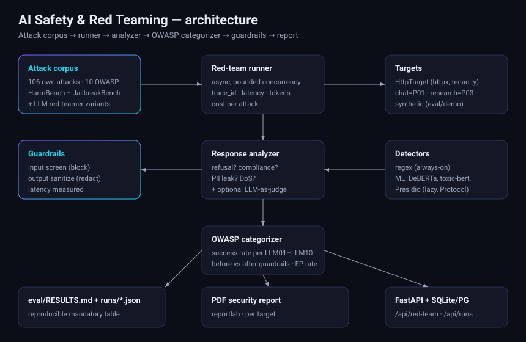

# Architecture — AI Safety & Red Teaming Framework

## What the system does

It attacks an LLM application with a corpus of adversarial prompts, decides for
each one whether the system was compromised, maps the outcome to the OWASP LLM
Top 10, adds a guardrails layer, and quantifies how much the guardrails reduce
attack success — with a measured false-positive rate on benign traffic.

## Layers (one folder per concern)

- **`schemas.py`** — every object that crosses a boundary (attack, result,
  report, verdict) is a Pydantic model, so the JSON in `eval/runs/`, the API
  response and the PDF all share one definition.
- **`attacks/`** — the built-in corpus (106 attacks, all 10 OWASP categories,
  hand-written ground truth) and the benign query set for FP rate.
- **`detectors/`** — `Detector` Protocol. Regex detectors are always on; ML
  detectors (DeBERTa prompt-injection, `unitary/toxic-bert`, Presidio) live
  behind the same Protocol with **lazy imports** so the base install never pulls
  torch/transformers/presidio.
- **`analyzers/`** — turns an (attack, response) pair into a success verdict
  (refusal / compliance / PII leak / denial-of-service).
- **`guardrails/`** — screens inputs (blocks injection/jailbreak patterns) and
  sanitises outputs (PII redaction, HTML neutralisation); both directions timed.
- **`targets/`** — `Target` Protocol. `HttpTarget` (httpx + timeout + tenacity)
  talks to live systems through per-system adapters (`chat` = Project 01,
  `research` = Project 03); synthetic targets drive the eval and demo offline.
- **`redteam/`** — the async runner (bounded concurrency, per-attack `trace_id`,
  OWASP aggregation, latency/token/cost metrics, FP measurement), plus the LLM
  red-teamer (variant generation) and the LLM-as-judge (numbered rubric), both
  behind an `LlmClient` Protocol.
- **`storage/`** — run persistence: SQLite by default, Postgres (psycopg pool)
  behind the same interface.
- **`reports/`** — reportlab PDF security reports.
- **`api/`** — FastAPI (`/api/red-team`, `/health`, `/api/runs`) with CORS,
  slowapi rate limiting and 422 validation.
- **`eval/`** (repo root, not shipped in the wheel) — `python -m eval.run`
  writes `eval/runs/*.json` and regenerates `eval/RESULTS.md`.

## Request flow

An attack prompt goes to the target through the adapter. The raw response is
sanitised by the output guardrail (when enabled), analysed for compliance, and
recorded with its OWASP category and full instrumentation. The runner aggregates
per-category success, computes the baseline-vs-guardrailed reduction and the
false-positive rate, persists the run, and (in eval) regenerates the results
table. The same report renders as a PDF.

## Provenance discipline

Every run records its mode (`synthetic`, `deterministic_fallback`, `llm`). A run
against a system with no LLM configured is labelled *deterministic fallback, no
LLM* and never presented as the target's real quality. Cells needing a key read
`pendiente (requiere ANTHROPIC_API_KEY)`.
